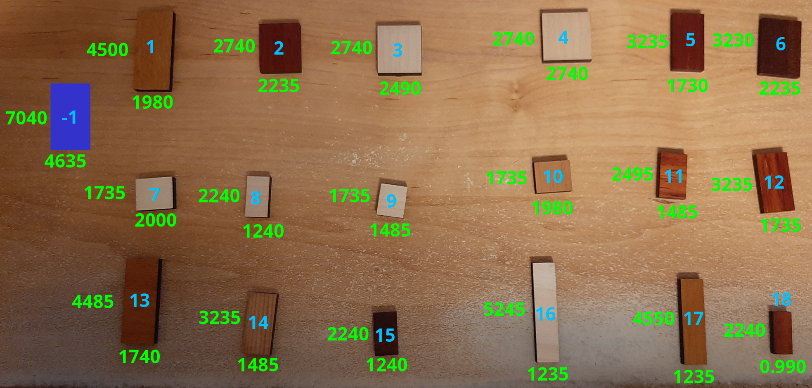

# Was will ich erreichen?
Dieses Programm versucht, das unten abgebildete Puzzle zu lösen.  
Bisher habe ich das leider noch nicht geschafft.

## Was tun die Funktionen im Programm?

### `step1_generate_candiates`:
Sammelt alle (sinnvollen) Kombinationen.  
Kombinationen mit weniger als 4 oder mehr als 8 Rechtecken passen nicht in das große Rechteck.

### `step2_deduplication`:
Schmeißt alle Kombinationen, die ähnlich sind (also Rechtecke mit den gleichen Seitenlängen haben) raus

### `step3_filter_fitting_candidates`:
Entfernt alle Kombinationen die unmöglich in das große Rechteck passen.  
Idee: 
- Einige Rechtecke einer Kombination sind drehbar, das muss berücksichtigt werden (nachfolgend Variable `prod`; wird mittels kartesischem Produkt realisiert)
- Für jedes `prod` schaue dir alle Permutationen `per` an. Somit habe ich alle Reihenfolgen, in denen ich eine Kombination in das große Rechteck legen kann.
- Lege die Rechtecke in der Reihenfolge, wie sie in `per` vorkommen in das große Rechteck
  - Lasse etwas Platz zwischen ihnen. Damit können kleinere Unterschiede ausgeglichen werden, die eventuell Lösungen "verhindern"
  - Wenn eine "Reihe" voll ist, gehe auf die nächste "Reihe"
  - Wenn alle Rechtecke rechnerisch (ohne den Platz zwischen ihnen) in dieser Reihenfolge in das Rechteck passen:  
    Schiebe jedes Rechteck in Richtung der unteren linken Ecke des großen Rechtecks, solange es kein anderes berührt  
    Wiederhole diesen Schritt, bis sich keiner des Rechtecke mehr bewegen lässt.
  - Test, ob nun alle Rechtecke innerhalb des großen Rechtecks liegen.

### `step4_calculate_matches`:
Um eine vollständige Lösung zu erhalten, müssen wir drei Kombinationen finden, die kein kleineres Rechteck gemeinsam haben.

### `step5_sort_final_combinations`:
Sortiert die gefundenen Kombinationen (nicht Lösungen) nach ihrer Relevanz.  
Je öfter eie Kombination in den Lösungen vorkommt, desto höher ist ihre Relevanz.  
Dies kann genutzt werden, um die "relevanteren" Lösungen manuell zu testen, wenn man will.

### `main`:
Ruft die oberen Funktionen mit den passenden Parametern auf.  
Enthält fast alle konfigurierbaren Parameter.  

Enthält außerdem ein paar Debug Sachen.

## Es geht um folgendes Puzzle:
- Das blaue Rechteck ist das "große Rechteck", in welches alle kleineren in drei Ebenen reingelegt werden müssen.  
- Überlappende Rechtecke sind nicht erlaubt.
- Rechtecke auf die "Kanten" zu stellen, ist nicht erlaubt.
- Alle kleineren Rechtecke müssen verwendet werden.
- Die grünen Zahlen geben die Länge der Seite in Zentimeter an.
- Die türkisen Zahlen entsprechen den IDs im Programm.

